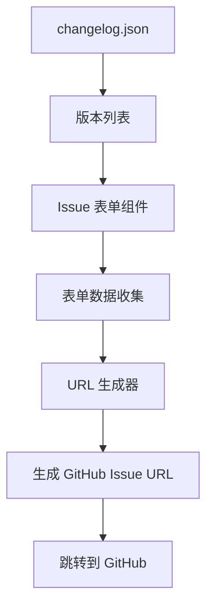

## 需求概述

用户需要将 `updata-2602-issue` 分支的 Issue 反馈模块合并到当前的 `updata-2602` 分支，同时解决原方案中 GitHub Token 暴露的安全问题。

## 核心功能

1. **Issue 反馈表单**：提供完整的 Issue 提交表单，包含类别选择、问题描述、重现步骤等字段
2. **GitHub 集成**：自动生成符合规范的 Issue URL，预填充表单内容
3. **Markdown 预览**：实时预览生成的 Issue 内容
4. **版本信息获取**：自动获取当前仓库版本列表

## 需要解决的问题

1. **安全隐患**：原方案通过前端直接调用 GitHub API 创建 Issue，需要暴露 Token
2. **代码质量**：存在调试代码、缺少 TypeScript 类型定义
3. **数据风险**：`changelog.json` 文件在 issue 分支被大量删除（-648行）

## 合并策略

采用选择性合并方案，仅合并功能代码，保留当前数据，重构 API 调用方式为 URL 生成方案。

## 技术栈

- **框架**: Vue 3 + TypeScript + VitePress
- **UI 组件**: Element Plus
- **Markdown 渲染**: x-markdown-vue
- **构建工具**: Vite + pnpm monorepo

## 实现方案

### 安全改造方案：URL 预填充代替 API 调用

原方案问题：`VITE_GITHUB_TOKEN` 会被打包到前端代码中，Token 暴露在客户端存在安全风险。

改造方案：

1. 移除所有 Token 相关配置和环境变量
2. 将 `createIssues` API 调用改为生成 GitHub Issue URL
3. 用户点击提交后跳转到 GitHub 页面，内容已预填充
4. 版本信息改为从本地 `changelog.json` 读取

### 架构设计



### 目录结构

```
apps/docs/zh/issue/
├── index.vue          # [MODIFY] 清理 console.log，改用 URL 方案
├── types.ts           # [NEW] TypeScript 类型定义
├── url-generator.ts   # [NEW] URL 生成工具函数
└── api.js             # [DELETE] 移除原 API 文件

apps/docs/.vitepress/
├── locales.mts        # [MODIFY] 添加"反馈"菜单项
└── data/
    └── changelog.json # [KEEP] 保留当前版本，不合并
```

## 实现细节

### URL 生成方案核心代码

```typescript
// url-generator.ts
interface IssueData {
  title: string;
  category: string;
  version: string;
  description: string;
  reproductionSteps: string;
  expectedBehavior: string;
  actualBehavior: string;
  componentName?: string;
}

export function generateGitHubIssueUrl(data: IssueData): string {
  const baseUrl = 'https://github.com/element-plus-x/Element-Plus-X/issues/new';
  const params = new URLSearchParams();

  params.set('title', `[${data.category}] ${data.title}`);
  params.set('body', generateIssueBody(data));
  if (data.componentName) {
    params.set('labels', data.componentName);
  }

  return `${baseUrl}?${params.toString()}`;
}

function generateIssueBody(data: IssueData): string {
  return `## 问题描述
${data.description}

## 环境
- Element-Plus-X 版本: \`${data.version}\`

## 重现步骤
${data.reproductionSteps}

## 期望行为
${data.expectedBehavior}

## 实际行为
${data.actualBehavior}`;
}
```

### 版本信息获取改造

```typescript
// 从 changelog.json 提取版本列表
import changelog from '../../.vitepress/data/changelog.json';

export function getAvailableVersions(): string[] {
  const versions = new Set<string>();

  Object.values(changelog).forEach((componentLog: any[]) => {
    componentLog.forEach(entry => {
      if (entry.version && entry.version !== 'unreleased') {
        versions.add(entry.version);
      }
    });
  });

  return Array.from(versions).sort().reverse();
}
```

## 注意事项

1. **数据保护**：确保不覆盖当前 `changelog.json` 的内容
2. **类型安全**：所有新增代码使用 TypeScript，遵循项目 tsconfig 规范
3. **代码清理**：移除所有 `console.log` 调试语句
4. **URL 编码**：确保中文内容正确编码，避免乱码

## 使用的 Agent Extensions

### GitHub MCP

- **用途**：从远程 issue 分支获取文件内容
- **预期结果**：获取 `index.vue`、`api.js`、`issue.md` 的完整内容用于分析和重构

### chrome-devtools

- **用途**：测试生成的 Issue URL 在浏览器中的跳转效果
- **预期结果**：验证预填充内容正确显示在 GitHub 页面
