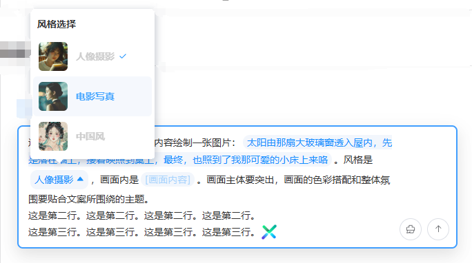

## Introduction

**`EditorSender`** is here! 🙊 Designed specifically for **multimodal models** and **custom prompt scenarios**, this input box component solves core development needs such as **tag insertion, content mentions, and custom prompt input**, better showcasing the power of multimodal functionality.

::: warning
There are certain development differences between the `EditorSender` component and the `Sender` component. Please choose according to your actual needs.

:::

## Code Demonstrations

### Basic Usage

<demo src="./demos/basic.vue"></demo>

### Placeholder Text

<demo src="./demos/placeholder.vue"></demo>

### Auto Focus

<demo src="./demos/autoFocus.vue"></demo>

### State Properties

<demo src="./demos/state.vue"></demo>

### Variant - Vertical Style

<demo src="./demos/variant.vue"></demo>

### Custom Action List

<demo src="./demos/action-list.vue"></demo>

### Custom Prefix

<demo src="./demos/prefix.vue"></demo>

### Custom Header

<demo src="./demos/header.vue"></demo>

### Custom Footer

<demo src="./demos/footer.vue"></demo>

### Custom Input Box Style

<demo src="./demos/custom-style.vue"></demo>

### Maximum Input Length

<demo src="./demos/max-length.vue"></demo>

### Submission Methods

<demo src="./demos/submit-type.vue"></demo>

### Paste Files

<demo src="./demos/pasteFile.vue"></demo>

## Advanced Usage

### Insert Text Content

<demo src="./demos/insert-text.vue"></demo>

### Insert HTML Content

<demo src="./demos/insert-html.vue"></demo>

### Insert Select Tag

<demo src="./demos/insert-select-tag.vue"></demo>

### Insert Input Tag

<demo src="./demos/insert-input-tag.vue"></demo>

### Insert User Tag

<demo src="./demos/insert-user-tag.vue"></demo>

### Insert Custom Tag

<demo src="./demos/insert-custom-tag.vue"></demo>

### Mixed Tag Override Writing

<demo src="./demos/mix-tag.vue"></demo>

### Prefix Prompt Tag

<demo src="./demos/prefix-tag.vue"></demo>

## Properties

| Property Name          | Type                             | Required | Default Value | Description                                                             |
|------------------------|---------------------------------|----------|-----------|----------------------------------------------------------------|
| `placeholder`          | String                          | false    | '请输入内容'   | The placeholder text of the input box                                                      |
| `device`               | 'pc' \| 'h5' \| 'h5'            | false    | 'auto'    | The device type of the editor                                                     |
| `autoFocus`            | Boolean                         | false    | false     | Whether to automatically focus on the input box after the component is mounted                                               |
| `variant`              | 'default' \| 'updown'           | false    | 'default' | The variant type of the input box: "default" for horizontal layout, and "updown" for vertical layout                             |
| `mentionConfig`        | MentionConfig                   | false    | undefined | Configuration items for the @mention feature                                                     |
| `triggerConfig`        | TriggerConfig[]                 | false    | undefined | Extend the trigger configuration items for custom popups                                                  |
| `selectConfig`         | SelectConfig[]                  | false    | undefined | Configuration items for tag dropdown selection                                                      |
| `maxLength`            | Number                          | false    | -1        | Limiting the maximum number of characters in an input box incurs significant performance overhead, so it is not recommended to set this unless necessary.                                     |
| `submitType`           | 'enter' \| 'shiftEnter'         | false    | 'enter'   | Control line break and submission mode |
| `customStyle`          | Record<string, any>             | false    | {}        | Used to modify the style of the input box                                                     |
| `loading`              | Boolean                         | false    | false     | The loading state of the send button: a loading animation is displayed when it is set to true.                                         |
| `disabled`             | Boolean                         | false    | false     | Whether to disable the input box: once disabled, input and interaction are not allowed.                                             |
| `clearable`            | Boolean                         | false    | false     | Whether to display the clear button                                                       |
| `headerAnimationTimer` | Number                          | false    | 300       | The duration of the header expansion/collapse animation, with the unit in milliseconds (ms)                                             |
| `tipConfig`            | Boolean \| TipConfig            | false    | true      | Enable the prefix tag or customize the template                                                 |
| `getPlugin`            | () => typeof XSender            | false    | undefined | Customize the update of basic library dependencies                                                     |

## Event

| Event Name          | Description                                                             | Callback Parameters                                             |
| ------------------ |---------------|-----------------------------------------------------------------|
| `submit`           | Triggered when submitting content       | null                                                            |
| `change`           | Triggered when the input content changes   | null                                                            |
| `cancel`           | Triggered when the loading state is canceled     | null                                                            |
| `pasteFile`        | The event triggered when pasting a file    | `interface PasteFileEvent{firstFile: File; fileList: FileList}` |

## Ref Method

| Method Name          | Type                             | Description                                                             |
|-------------------|-------------------------------------------------------------------|----------------------------------------------------|
| `getSender`       | () => XSender                                                     | Get the XSender instance object of the current sender                                |
| `focus`           | (type: 'first' \| 'last' \| 'mark') => void                       | Focus the cursor on the specified position in the text |
| `blur`            | () => void                                                        | Remove the focus from the input box                                           |
| `selectAll`       | () => void                                                        | Select all content in the input box                                            |
| `clear`           | () => void                                                        | Clear the content of the input box                                            |
| `setSelect `      | (key: string, id: string) => void                                 | Insert a selection tag                                           |
| `setInput`        | (key: string, placeholder: string, defaultValue?: string) => void | Insert an input tag                                           |
| `setMention`      | (id: string) => void                                              | Insert a mention tag                                           |
| `setTrigger`      | (key: string, id: string) => void                                 | Insert a custom trigger tag                                       |
| `setChatNode`     | (model: ChatNode[][]) => void                                     | Insert multiple tags of mixed types at the current cursor position                                         |
| `setHtml`         | (html: string) => void                                            | Insert an HTML fragment at the current cursor position (it is recommended to use inline or inline-block elements)                                         |
| `setText`         | (txt: string) => void                                             | Insert text at the current cursor position                                     |
| `showSelect`      | (key: string, elm: HTMLElement) => void                           | Call the method to display the tag selection popup externally                                     |
| `showTip`         | (props: Record<string, string>) => void                           | Open the prefix tip tag                                           |
| `closeTip`        | () => void                                                        | Close the prefix tip tag                                           |
| `senderState`     | SenderState                                                       | Expose the component state object to identify whether the content is empty and whether the prefix tip is enabled                       |

## Slot

| Slot Name      | Parameters | Description                                        |
| -------------- | ---------- | -------------------------------------------------- |
| `#header`      | -          | Used for customizing input box header content      |
| `#prefix`      | -          | Used for customizing input box prefix content      |
| `#action-list` | -          | Used for customizing input box action list content |
| `#footer`      | -          | Used for customizing input box footer content      |

## More customized features
1. **Custom interactive popup**: Please refer to [CustomDialog](https://jianfv.top/XSender/guide/customDialog).
2. **Custom interactive component**: Please refer to [CustomComponent](https://jianfv.top/XSender/guide/customComponent).

## Functional Features
1. **Full-type Tag Engine**: Seamlessly supports multiple tag types such as @users, select tags, and custom tags. Tag insertion/update/management is a breeze, meeting complex content tagging needs.
2. **Cross-device Adaptive Interaction**: PC has a built-in popup system, while H5 supports custom popups. Automatically adapts to different device operation habits, balancing native experience with customization freedom.
